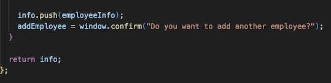
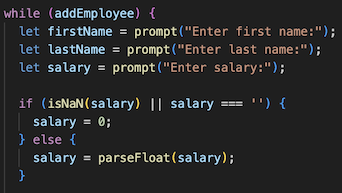
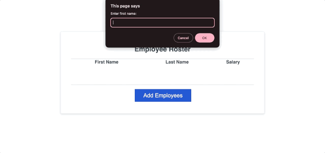

# Homework-Challenge-3

## Technologies Used

HTML, CSS and JavaScript

## Description

Employee payroll tracker is an administrative tool to keep track of employees data containing their names and salaries, perfect for HR and Management use. This is a user friendly website that has easy learning curve and smooth workflow.

## Usage

User can add mutiple employees to employee roster by clicking on "Add Employees" button and entering the employee information in the prompt windows. A user can input as many employees as they want as there is no limit to the number of rows that can be entered. Once user is done entering the information, they can click on "Cancel" button which closes the prompt window and employees first name, last name and their annual salary is displayed in the employee roster table. By using Devtools, a user can find the calculated average salary between employees as well as a random drawing winner.

## Code Snippet

In above screenshot, the addEmployee variable is used to control the loop based on the user's choice to continue adding employees or not.

A conditional if else statement inside a while loop to run if the salary is not a number or empty then the salary should be 0. Otherwise it will show the salary provided.

## Gif Demo

## Author Info

[Portfolio] (https://asgithub11.github.io/Homework-Challenge-2/)
[Github] (https://github.com/ASgithub11)
[LinkedIn] (https://www.linkedin.com/in/aisha-siddiqa-726578311/)

## License

MIT License

Copyright (c) 2024 MIT

Permission is hereby granted, free of charge, to any person obtaining a copy of this software and associated documentation files (the "Software"), to deal in the Software without restriction, including without limitation the rights to use, copy, modify, merge, publish, distribute, sublicense, and/or sell copies of the Software, and to permit persons to whom the Software is furnished to do so, subject to the following conditions:

The above copyright notice and this permission notice shall be included in all copies or substantial portions of the Software.

THE SOFTWARE IS PROVIDED "AS IS", WITHOUT WARRANTY OF ANY KIND, EXPRESS OR IMPLIED, INCLUDING BUT NOT LIMITED TO THE WARRANTIES OF MERCHANTABILITY, FITNESS FOR A PARTICULAR PURPOSE AND NONINFRINGEMENT. IN NO EVENT SHALL THE AUTHORS OR COPYRIGHT HOLDERS BE LIABLE FOR ANY CLAIM, DAMAGES OR OTHER LIABILITY, WHETHER IN AN ACTION OF CONTRACT, TORT OR OTHERWISE, ARISING FROM, OUT OF OR IN CONNECTION WITH THE SOFTWARE OR THE USE OR OTHER DEALINGS IN THE SOFTWARE.

## Credits

N/A

## Badges

N/A

## Features

N/A

## Contributing

N/A

## Tests

N/A

